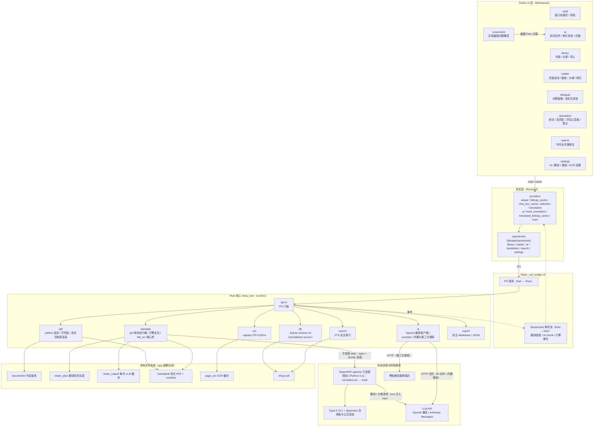
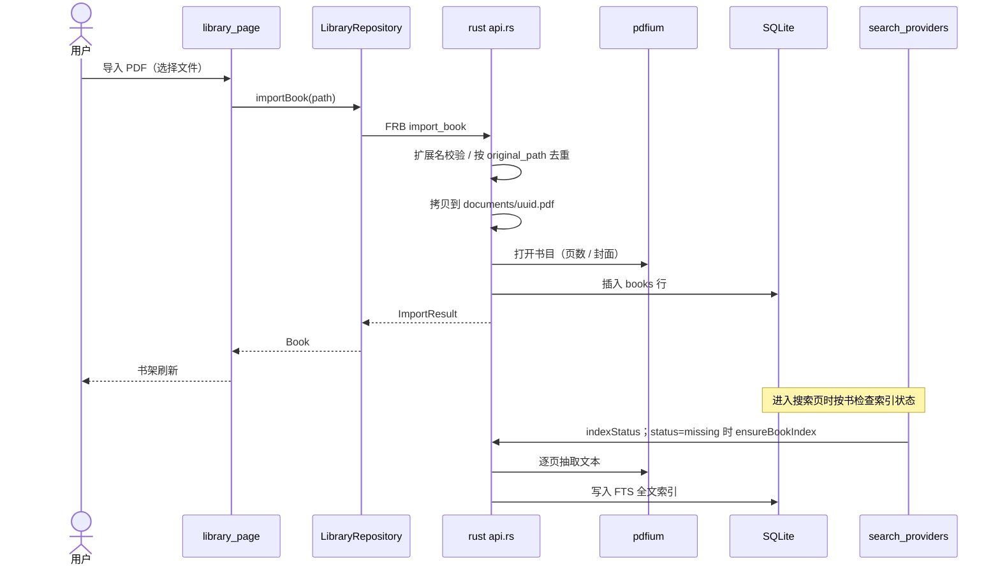
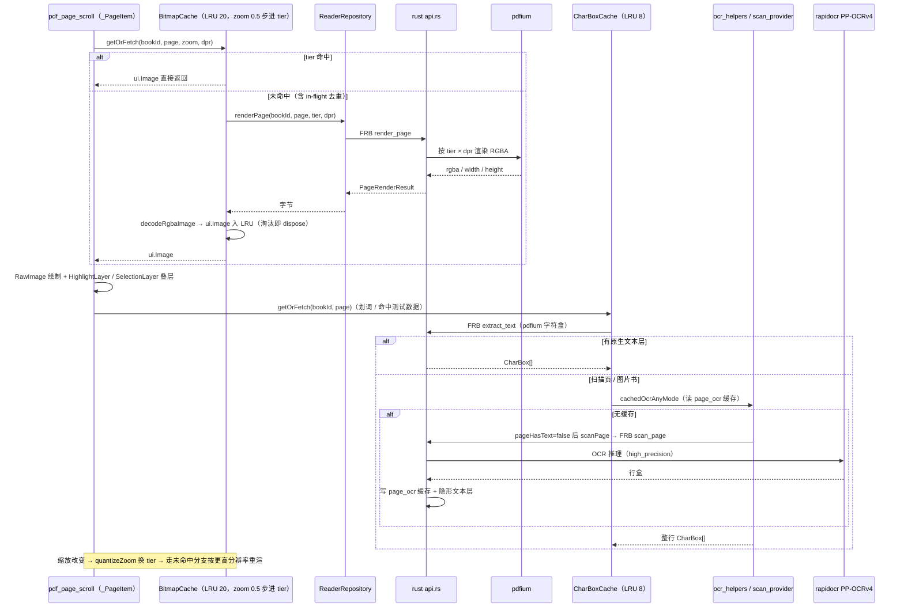
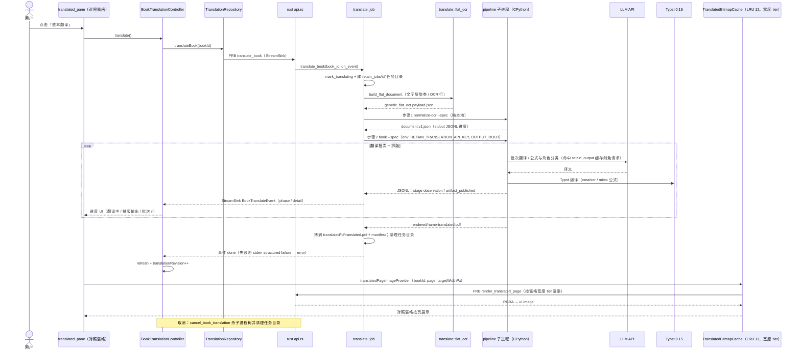
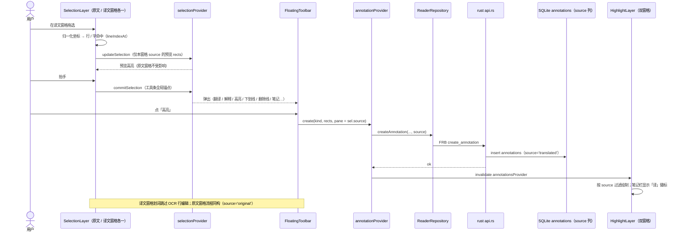
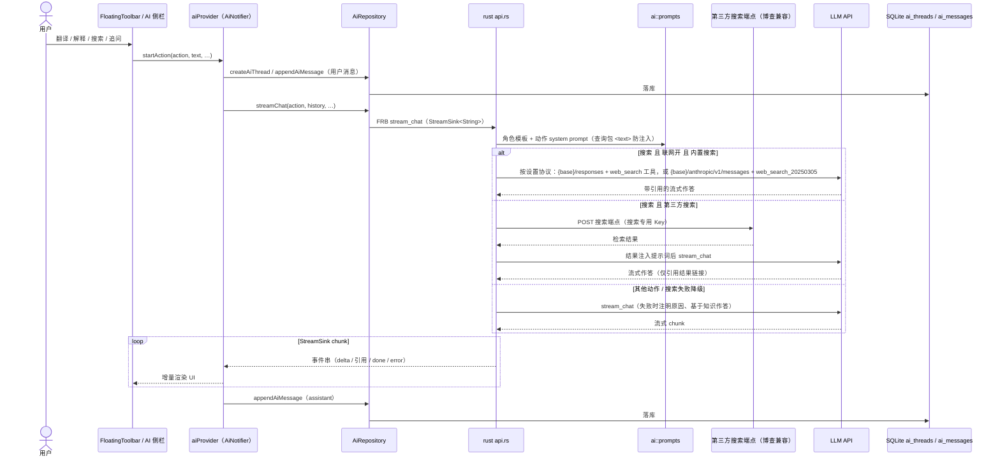

# 智阅 · 架构图与核心时序图

> 基线代码：`feat/retain-engine`（RetainPDF 翻译栈版）。全部图为 Mermaid，可直接粘贴到
> 支持 Mermaid 的渲染器（GitHub / VS Code 预览 / mermaid.live）。
> 模块名与仓库路径对应：Dart 侧 `lib/features/*`、`lib/data/repositories/*`；
> Rust 侧 `rust/src/*`；桥接层 flutter_rust_bridge v2（FRB）。

## 0. 通信契约一览

| 通道 | 方向 | 承载内容 |
|---|---|---|
| FRB FFI 调用 | Dart → Rust | 全部业务调用：渲染、字符盒、DB 读写、OCR、AI 触发、翻译触发 |
| FRB StreamSink | Rust → Dart | `translate_book` 进度事件、`stream_chat` 流式 chunk、`install_engine` 事件 |
| 子进程 argv + stdout/stderr | Rust → RetainPDF pipeline | 两步 spec 文件路径；stdout JSONL 进度/产物事件；stderr `structured failure json:` |
| 环境变量 | Rust → pipeline | `RETAIN_TRANSLATION_API_KEY`（密钥不落盘）、`TYPST_BIN`、`TYPST_PACKAGE_PATH`、`OUTPUT_ROOT` |
| HTTP（流式） | Rust ai → LLM API | AI 动作（翻译/解释/搜索/对话/视觉）、内置搜索（Responses / Anthropic 两协议） |
| HTTP | Rust ai → 搜索端点 | 第三方（博查兼容）联网搜索 |
| HTTP | pipeline → LLM API | 翻译批次、公式/角色分类（key 由 env 注入，智阅 Rust 侧不代发） |
| SQLite（schema v9） | Rust 内部 | 书目、阅读进度、标注（含 `source` 窗格列）、AI 会话、OCR 缓存、FTS 索引 |

## 1. 架构图

要点：

- **两个 LLM 调用方**：AI 动作与内置搜索由 Rust `ai` 模块直连 LLM；**翻译请求由 pipeline 子进程自己发**（key 经 env 注入，spec 只写 `credential_ref`），智阅 Rust 侧只解析其 stdout 进度。
- **pipeline 是独立进程**（随包 CPython，无 venv），崩溃/取消只影响子进程树；PyMuPDF（AGPL）因此被隔离在进程边界外。
- **译文与原文是两份 PDF**：对照窗格按页宽 tier 渲染 `translated/{book_id}/translated.pdf`，标注用 `annotations.source` 区分窗格（schema v9）。

## 2. 核心时序图

### 2.1 书籍导入与全文索引

### 2.2 页面渲染与文本层（含 OCR 回退、缩放 tier）

### 2.3 整本翻译（RetainPDF 两步管线）

### 2.4 划词与双窗格标注（schema v9 source）

### 2.5 AI 动作与联网搜索（内置双协议 / 第三方）

